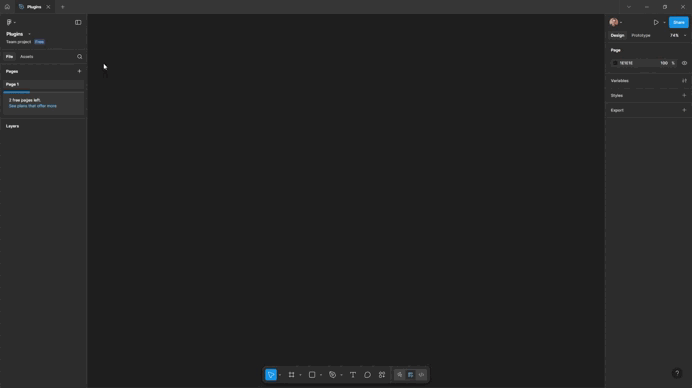
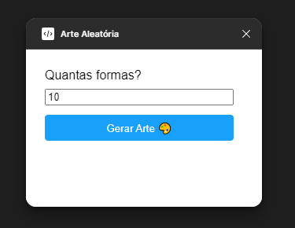
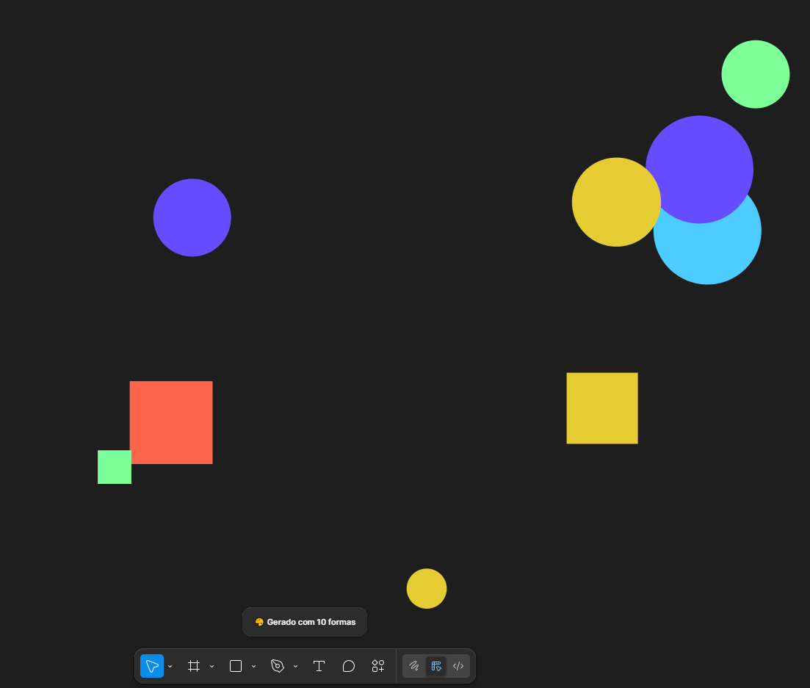
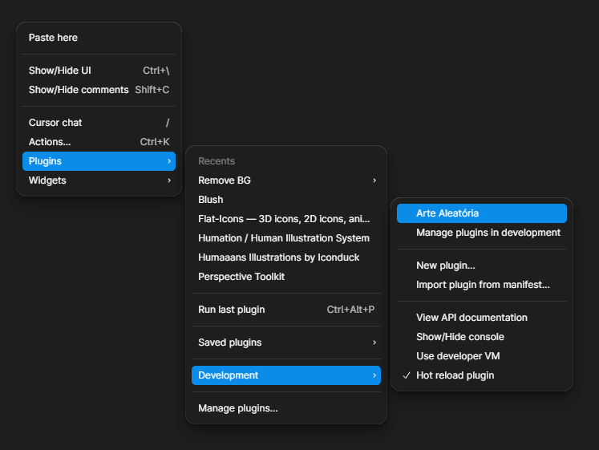

# 🎨 Arte Aleatória – Plugin para Figma
Este é um plugin simples e divertido para Figma que gera arte aleatória com formas geométricas e cores vibrantes

## ✨ O que ele faz

- Cria formas (círculos e retângulos) com posições e tamanhos aleatórios
- Aplica cores vibrantes em cada forma
- Permite escolher a quantidade de formas via interface

## 🧩 Como usar

1. Clone ou baixe este repositório
2. No Figma, vá em `Menu > Plugins > Development > Import plugin from manifest`
3. Selecione o arquivo `manifest.json`
4. Execute o plugin via `Menu > Plugins > Development > Arte Aleatória`

## 📦 Estrutura

- `code.js` – Lógica do plugin
- `ui.html` – Interface com campo de quantidade e botão
- `manifest.json` – Configuração do plugin

## 💡 Sobre

Este plugin foi criado como meu primeiro experimento combinando **design e programação criativa**.

---

Feito com ❤️ por [Ste D'Elboux]

